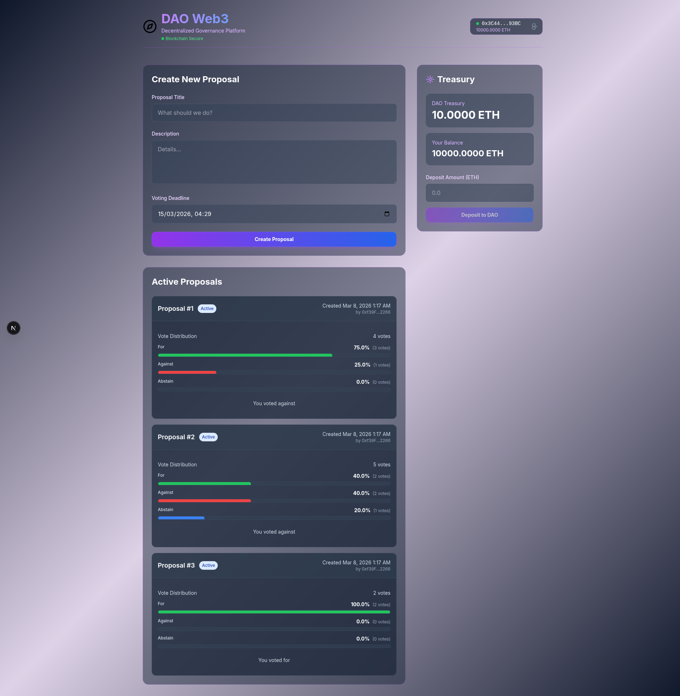
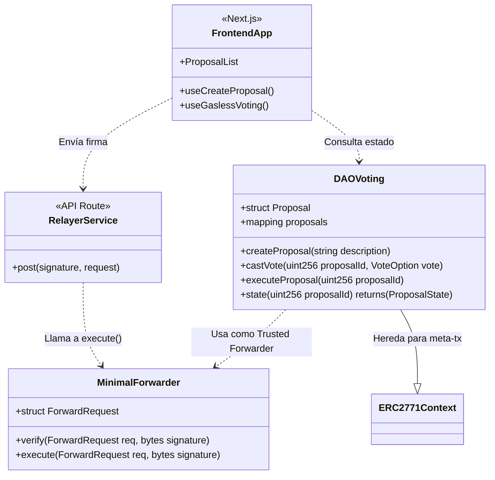

# 🏛️ DAO Governance System with Gasless Voting



Este proyecto implementa una Organización Autónoma Descentralizada (DAO) robusta, diseñada para ofrecer una experiencia de gobernanza descentralizada eficiente. El sistema destaca por su integración de meta-transacciones (voto sin gas), permitiendo que los usuarios participen sin preocuparse por los costos de red directos.

## 🚀 Funcionalidades Principales

### 1. Gobernanza Descentralizada
- **Creación de Propuestas:** Los usuarios con un balance suficiente (10% del total de la DAO) pueden proponer nuevas iniciativas.
- **Ciclo de Vida:** Las propuestas pasan por estados de `Pending`, `Active`, `Succeeded`/`Defeated` y finalmente `Executed`.
- **Votación Híbrida:** Soporte para votación tradicional (transacción directa) y **Gasless Voting** (vía firmas EIP-712).

### 2. Infraestructura Web3
- **Conectividad:** Integración profunda con wallets vía Wagmi y Viem.
- **Relayer Service:** API interna para procesar transacciones firmadas por los usuarios, actuando como intermediario para pagar el gas.
- **Funding Panel:** Interfaz dedicada para depositar fondos y fortalecer el tesoro de la DAO.

### 3. Interfaz de Usuario (UX/UI)
- **Dashboard en Tiempo Real:** Visualización del estado de las propuestas y conteo de votos actualizado.
- **Responsive Design:** Optimizado para dispositivos móviles y escritorio utilizando Tailwind CSS.
- **Feedback Visual:** Notificaciones y estados de carga (toasts) para cada interacción con la blockchain.

---

## 🏗️ Arquitectura del Sistema (UML)

A continuación se detalla la relación entre los contratos inteligentes y la lógica de negocio:



---

## 🛠️ Tecnologías y Herramientas

### Smart Contracts (Back-end)
- **Solidity (^0.8.24):** Lógica de contratos inteligentes.
- **Foundry:** Suite de desarrollo para compilación, testing y despliegue.
- **OpenZeppelin:** Implementaciones estándar de `Ownable`, `EIP712` y `ERC2771`.

### Web App (Front-end)
- **Next.js 15+:** Framework de React para la aplicación web y rutas de API (Relayer).
- **TypeScript:** Desarrollo con tipado fuerte.
- **Viem & Wagmi:** Librerías de bajo nivel y hooks para interacción con la EVM.
- **Tailwind CSS & Headless UI:** Estilizado moderno y componentes accesibles.
- **TanStack Query:** Gestión de estado y caché de datos blockchain.

---

## 📂 Estructura del Repositorio

-   `dao/sc/`: Contratos inteligentes y scripts de Foundry.
-   `dao/web/`: Aplicación Next.js (Frontend + API Routes).
-   `dao/docs/`: Reportes de desarrollo, análisis de errores y documentación de refactorización.

## ⚙️ Configuración Rápida

1.  **Smart Contracts:**
    ```bash
    cd sc
    forge build
    # Despliegue en Anvil
    forge script script/DeployScript.s.sol --rpc-url http://127.0.0.1:8545 --broadcast
    ```

2.  **Frontend:**
    ```bash
    cd web
    npm install
    npm run dev
    ```


<p align="center">
  <video src="assets/demo-daovoting.webm" width="100%" controls>
    Tu navegador no soporta el elemento de video.
  </video>
</p>


---
*Desarrollado como una solución integral de gobernanza Web3.*
