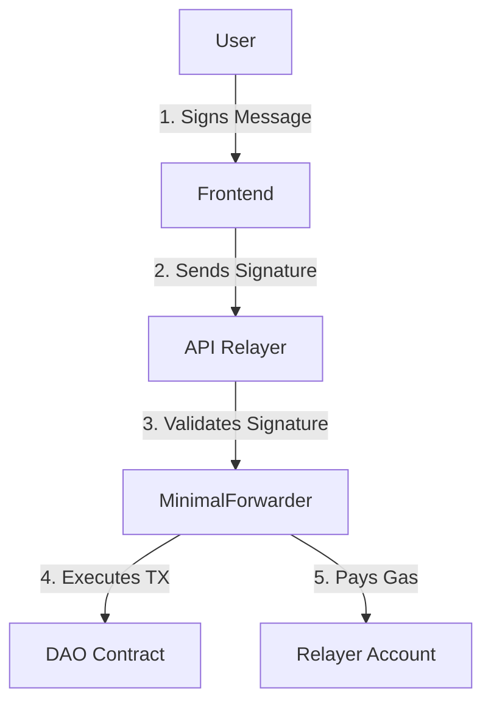

# DAO Governance Platform

A Next.js 16 application for decentralized governance with gasless voting capabilities.

## Features

- **Wallet Integration**: Connect MetaMask and manage your DAO participation
- **DAO Funding**: Deposit and withdraw funds from the DAO treasury
- **Proposal Management**: Create, view, and vote on governance proposals
- **Gasless Voting**: Vote on proposals without paying gas fees using a relayer service
- **Real-time Updates**: Live updates for proposal states and voting results

## Architecture

### Frontend
- Next.js 16 with App Router
- React 18 with Hooks
- TypeScript for type safety
- Tailwind CSS for styling
- Ethers.js for Web3 interactions

### Smart Contracts
- DAO Voting Contract: Manages proposal creation and voting
- MinimalForwarder: Handles gasless transactions
- OpenZeppelin contracts for security primitives

### Relayer Service
- Node.js API endpoint (`/api/relay`)
- Validates EIP-712 signatures
- Submits meta-transactions to the blockchain
- Pays gas fees on behalf of users

## Meta-Transaction Flow



## Getting Started

### Prerequisites
- Node.js 18+
- npm or yarn
- MetaMask wallet

### Installation

```bash
# Clone the repository
git clone https://github.com/your-repo/dao-governance.git

cd dao-governance/web

# Install dependencies
npm install

# Start development server
npm run dev
```

## Configuration

Copy `.env.example` to `.env.local` and fill in your values:

```bash
NEXT_PUBLIC_DAO_ADDRESS=0xf39Fd6e51aad88F6F4ce6aB8827279cffFb92266
NEXT_PUBLIC_FORWARDER_ADDRESS=0x70997970C51812dc3A010C7d01b50e0d17dc79C8
NEXT_PUBLIC_CHAIN_ID=31337
RPC_URL=http://127.0.0.1:8545
```

## Scripts

```bash
# Development server
npm run dev

# Build for production
npm run build

# Start production server
npm start

# Run linting
npm run lint

# Run tests
npm run test
```

## Environment Variables

| Variable | Description |
|---------|-------------|
| `NEXT_PUBLIC_DAO_ADDRESS` | Address of the DAO contract |
| `NEXT_PUBLIC_FORWARDER_ADDRESS` | Address of the MinimalForwarder contract |
| `NEXT_PUBLIC_CHAIN_ID` | Chain ID for the network |
| `RELAYER_PRIVATE_KEY` | Private key for the relayer account (server-side only) |
| `RELAYER_ADDRESS` | Address of the relayer account |
| `RPC_URL` | RPC endpoint for the blockchain |

## Project Structure

```
web/
├── components/     # Reusable UI components
├── hooks/         # Custom React hooks
├── pages/         # Next.js pages and API routes
├── public/        # Static assets
├── styles/        # Global styles
├── lib/           # Utility functions and helpers
└── types/         # TypeScript type definitions
```

## License

MIT License